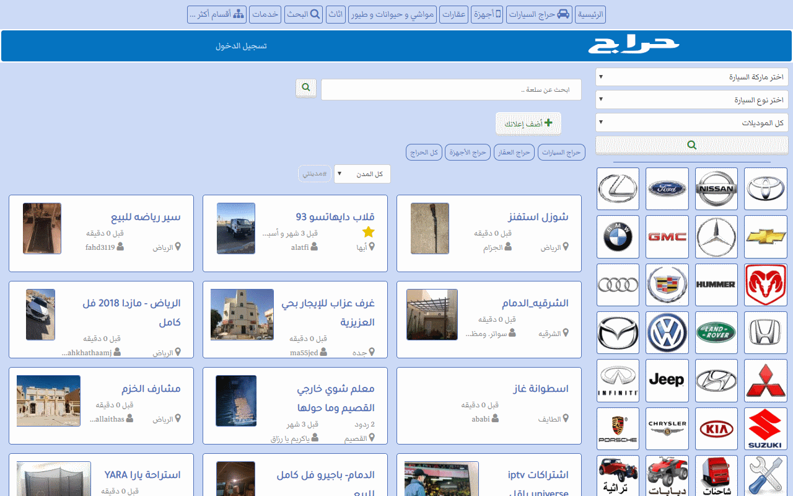

# Haraj UI Enhanced

Browser extension for enhancement of [haraj.com.sa](https://haraj.com.sa/) UI to show more contrasting colors and more posts on home screen, as a grid.

## Features

* Styling changes for better visibility, background colors, borders, and boxes.
* Main page converted to a responsive grid layout. Allows to see more posts in one screen.
* Change typography, color, font and size of titles, headers, links, and content.
* Tag labels are now side by side, instead of stacked. Saves some space.
* Contact label and contact method/number are on one line.
* Enhanced footer layout.

## Websites Supported

Haraj UI Enhanced supports and works with these [haraj.com.sa](https://haraj.com.sa/) websites:

* Main website [https://haraj.com.sa/](https://haraj.com.sa/)
* Main website [https://haraj.com/](https://haraj.com/)
* WWW website [https://www.haraj.com.sa/](https://www.haraj.com.sa/)
* WWW website [https://www.haraj.com/](https://www.haraj.com/)
* Beta website [https://beta.haraj.com.sa/](https://beta.haraj.com.sa/)
* Legacy website [https://legacy.haraj.com.sa/](https://legacy.haraj.com.sa/)

## Extension Stores

Haraj UI Enhanced is available on these browser extension stores

* [Haraj UI Enhanced on Google Web Store](https://chrome.google.com/webstore/detail/haraj-ui-enhanced/inckeepmpnkecnfnhnkkknacoekfdanm)
* [Haraj UI Enhanced on Microsoft Store](https://microsoftedge.microsoft.com/addons/detail/pkikfdijbelhdiajalmcalcmbkpclami)
* [Haraj UI Enhanced on Firefox Browser Add-ons](https://addons.mozilla.org/en-US/firefox/addon/haraj-ui-enhanced/)

## Browser support

Haraj UI Enhanced uses CSS Grid, hence, modern browsers with CSS Grid support are required. Includes:

<!-- * [Apple Safari](https://www.apple.com/safari/) 10.1 + -->
* [Brave Browser](https://brave.com/)
* [Google Chrome](https://www.google.com/chrome/) 57 +
* [Microsoft Edge](https://www.microsoft.com/edge/) 16 +
* [Mozilla Firefox](https://www.mozilla.org/firefox/) 52+
* [Opera Browser](https://www.opera.com/) 44 +
* [Vivaldi Browser](https://vivaldi.com/)
* And other browsers implementing WebKit, Chromium, Blink, or other CSS Grid compatible browser rendering engines.

## Feedback and Suggestions

We will be happy to hear from users, please send all feedback and suggestions to @pdfcoffee

## Notice of Non-Affiliation and Disclaimer

We are not affiliated, associated, authorized, endorsed by, or in any way officially connected with haraj.com.sa, or any of its subsidiaries or its affiliates. The official haraj.com.sa website can be found at https://haraj.com.sa/.

Haraj UI Enhanced might change, break, or stop working at any time.
